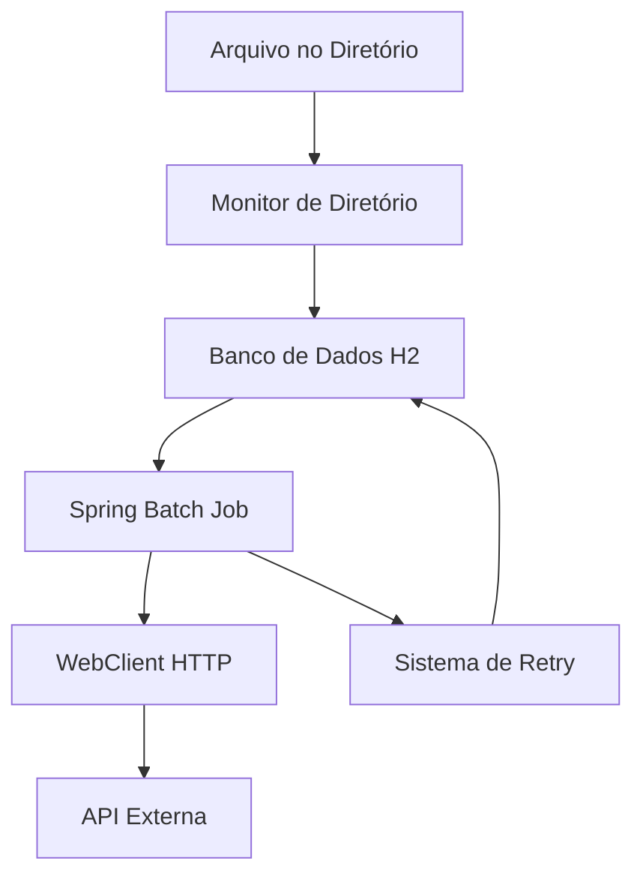

# 📁 File Sync Batch

> Sistema moderno de processamento de arquivos construído com Spring Boot 3.x, substituindo workflows legados Oracle/Tibco por uma solução reativa e escalável.

[](https://openjdk.java.net/)
[](https://spring.io/projects/spring-boot)
[](https://spring.io/projects/spring-batch)
[](LICENSE)

## 📋 Índice

- [Sobre o Projeto](#-sobre-o-projeto)
- [Arquitetura](#-arquitetura)
- [Fluxo de Funcionamento](#-fluxo-de-funcionamento)
- [Tecnologias Utilizadas](#-tecnologias-utilizadas)
- [Pré-requisitos](#-pré-requisitos)
- [Instalação](#-instalação)
- [Configuração](#-configuração)
- [Como Usar](#-como-usar)
- [Estrutura do Projeto](#-estrutura-do-projeto)
- [Funcionalidades](#-funcionalidades)
- [Troubleshooting](#-troubleshooting)
- [Contribuição](#-contribuição)

## 🎯 Sobre o Projeto

Este projeto foi desenvolvido para **modernizar processos legados** que utilizavam rotinas Oracle e Tibco para processamento de arquivos. A solução oferece:

### 🔄 **Problema Original (AS IS)**
```
Arquivo → Diretório → Rotinas Oracle → Tibco → Sistema Destino
```

### ✨ **Solução Moderna (TO BE)**
```
Arquivo → Diretório → Spring Batch → WebClient → Sistema Destino
```

### 🎯 **Objetivos**
- ✅ Eliminar dependência de tecnologias obsoletas
- ✅ Melhorar performance e confiabilidade  
- ✅ Implementar retry automático e logs detalhados
- ✅ Facilitar manutenção e evolução do sistema
- ✅ Utilizar tecnologias modernas e bem suportadas

## 🏗️ Arquitetura

### **Componentes Principais**



### **Tecnologias por Camada**

| Camada | Tecnologia | Responsabilidade |
|--------|------------|------------------|
| **Monitoramento** | Java NIO WatchService | Detecta novos arquivos |
| **Persistência** | Spring Data JPA + H2 | Armazena dados e controle |
| **Processamento** | Spring Batch 5.x | Processa arquivos em lote |
| **Comunicação** | WebClient (Reactive) | Chama APIs externas |
| **Agendamento** | Spring Scheduling | Executa jobs periodicamente |

## 🔄 Fluxo de Funcionamento

### **1. Detecção de Arquivo**
```java
// Monitor detecta arquivo no diretório
WatchService → ENTRY_CREATE → processarNovoArquivo()
```

### **2. Persistência**
```java
// Salva arquivo na base com flag enviado=false
ArquivoProcessamento arquivo = new ArquivoProcessamento(nome, conteudo);
repository.save(arquivo);
```

### **3. Processamento Batch**
```java
// A cada 10 segundos, busca arquivos não enviados
@Scheduled(fixedDelay = 10000)
List<ArquivoProcessamento> pendentes = repository.findByEnviadoFalse();
```

### **4. Envio para API**
```java
// Utiliza WebClient para enviar dados
WebClient.post().uri("/processar").body(dados).retrieve();
```

### **5. Controle de Status**
```java
// Atualiza status baseado no resultado
arquivo.setEnviado(true); // Sucesso
arquivo.setTentativas(tentativas + 1); // Falha
```

## 💻 Tecnologias Utilizadas

### **Core Framework**
- **Java 17+** - Linguagem base com recursos modernos
- **Spring Boot 3.2.5** - Framework principal
- **Spring Batch 5.x** - Processamento em lote
- **Spring Data JPA** - Acesso a dados

### **Banco de Dados**
- **H2 Database** - Banco em memória para estudos
- **Oracle JDBC** - Suporte para produção (opcional)

### **HTTP Client**
- **WebClient** - Cliente HTTP reativo (recomendado)
- **RestTemplate** - Cliente HTTP tradicional (alternativa)

### **Utilitários**
- **Lombok** - Redução de código boilerplate
- **SLF4J + Logback** - Sistema de logs
- **JUnit 5** - Testes unitários

## 📋 Pré-requisitos

### **Obrigatórios**
- ☕ **Java 17 ou superior**
  ```bash
  java -version
  # Deve mostrar versão 17.x.x ou superior
  ```

- 📦 **Maven 3.6+** ou **Gradle 7+**
  ```bash
  mvn -version
  # ou
  gradle -version
  ```

### **Opcionais**
- 🐳 **Docker** - Para executar em container
- 🔧 **IDE** - IntelliJ IDEA, Eclipse, VS Code

## 🚀 Instalação

### **1. Clone o Repositório**
```bash
git clone https://github.com/seu-usuario/file-sync-batch.git
cd file-sync-batch
```

### **2. Compilar o Projeto**

**Com Maven:**
```bash
mvn clean compile
```

**Com Gradle:**
```bash
./gradlew build
```

### **3. Executar Testes**
```bash
mvn test
# ou
./gradlew test
```

### **4. Executar a Aplicação**
```bash
mvn spring-boot:run
# ou
./gradlew bootRun
```

## ⚙️ Configuração

### **application.properties**
```properties
# Aplicação não-web
spring.main.web-application-type=none

# Diretório monitorado
app.diretorio.entrada=/tmp/entrada

# API externa
app.api.externa.url=http://localhost:8080/api

# Banco H2 (estudos)
spring.datasource.url=jdbc:h2:mem:testdb
spring.datasource.username=sa
spring.datasource.password=
spring.h2.console.enabled=true

# JPA
spring.jpa.hibernate.ddl-auto=create-drop
spring.jpa.show-sql=true

# Logs
logging.level.com.estudos=DEBUG
```

### **Configurações Importantes**

| Propriedade | Padrão | Descrição |
|------------|--------|-----------|
| `app.diretorio.entrada` | `/tmp/entrada` | Diretório monitorado |
| `app.api.externa.url` | `http://sistema-destino/api` | URL da API destino |
| `fixedDelay` | `10000ms` | Intervalo do batch (10s) |
| `chunk` | `10` | Tamanho do lote de processamento |

## 📖 Como Usar

### **1. Preparar o Ambiente**
```bash
# Criar diretório de entrada
mkdir -p /tmp/entrada

# Verificar se a aplicação está rodando
tail -f logs/application.log
```

### **2. Adicionar Arquivo para Processamento**
```bash
# Copiar arquivo para o diretório monitorado
cp meu-arquivo.txt /tmp/entrada/

# O sistema detectará automaticamente e processará
```

### **3. Monitorar o Processamento**
```bash
# Verificar logs em tempo real
tail -f logs/application.log | grep "Arquivo"

# Acessar console H2 (se habilitado)
http://localhost:8080/h2-console
```

### **4. Verificar Status no Banco**
```sql
-- Conectar ao H2 Console
-- JDBC URL: jdbc:h2:mem:testdb

-- Ver todos os arquivos processados
SELECT * FROM arquivo_processamento;

-- Ver apenas pendentes
SELECT * FROM arquivo_processamento WHERE enviado = false;

-- Ver estatísticas
SELECT 
    enviado,
    COUNT(*) as total,
    AVG(tentativas) as media_tentativas
FROM arquivo_processamento 
GROUP BY enviado;
```

## 📁 Estrutura do Projeto

```
file-sync-batch/
├── src/
│   ├── main/
│   │   ├── java/
│   │   │   └── com/estudos/filesyncbatch/
│   │   │       ├── ProcessadorArquivosApplication.java
│   │   │       ├── config/
│   │   │       │   └── BatchConfiguration.java
│   │   │       ├── entity/
│   │   │       │   └── ArquivoProcessamento.java
│   │   │       ├── repository/
│   │   │       │   └── ArquivoProcessamentoRepository.java
│   │   │       ├── service/
│   │   │       │   ├── MonitorDiretorioService.java
│   │   │       │   └── ApiExternaClient.java
│   │   │       └── scheduler/
│   │   │           └── JobScheduler.java
│   │   └── resources/
│   │       ├── application.properties
│   │       └── logback-spring.xml
│   └── test/
│       └── java/
│           └── com/estudos/filesyncbatch/
├── docs/
│   ├── architecture.md
│   └── troubleshooting.md
├── docker/
│   ├── Dockerfile
│   └── docker-compose.yml
├── pom.xml
└── README.md
```

## ✨ Funcionalidades

### **🔍 Monitoramento de Diretório**
- ✅ Detecção automática de novos arquivos
- ✅ Suporte a múltiplos formatos
- ✅ Processamento assíncrono
- ✅ Remoção automática após processamento

### **💾 Persistência Inteligente**
- ✅ Controle de status (enviado/pendente)
- ✅ Contador de tentativas
- ✅ Log de erros detalhado
- ✅ Timestamps de criação e envio

### **🔄 Sistema de Retry**
- ✅ Até 3 tentativas por arquivo
- ✅ Backoff exponencial
- ✅ Log detalhado de falhas
- ✅ Quarentena para arquivos problemáticos

### **📊 Processamento em Lote**
- ✅ Configurável (chunk size)
- ✅ Transacional
- ✅ Paralelizável
- ✅ Monitoramento via logs

### **🌐 Integração HTTP**
- ✅ WebClient reativo
- ✅ Timeout configurável
- ✅ Retry automático
- ✅ Headers customizáveis

## 🔧 Troubleshooting

### **Problemas Comuns**

#### **1. Arquivo não está sendo detectado**
```bash
# Verificar se o diretório existe
ls -la /tmp/entrada/

# Verificar permissões
chmod 755 /tmp/entrada/

# Verificar logs
grep "MonitorDiretorioService" logs/application.log
```

#### **2. Erro de conexão com API externa**
```bash
# Testar conectividade
curl -X POST http://localhost:8080/api/processar \
  -H "Content-Type: application/json" \
  -d '{"teste": "conexao"}'

# Verificar configuração
grep "app.api.externa.url" src/main/resources/application.properties
```

#### **3. Banco de dados não inicializa**
```properties
# Verificar configuração H2
spring.datasource.url=jdbc:h2:mem:testdb
spring.datasource.driver-class-name=org.h2.Driver
spring.jpa.hibernate.ddl-auto=create-drop
```

#### **4. Job não executa a cada 10 segundos**
```java
// Verificar se @EnableScheduling está presente
@SpringBootApplication
@EnableScheduling  // <- Esta anotação é obrigatória
public class ProcessadorArquivosApplication {
```

### **Debug Avançado**

#### **Habilitar Logs Detalhados**
```properties
# Logs do Spring Batch
logging.level.org.springframework.batch=DEBUG

# Logs do WebClient
logging.level.org.springframework.web.reactive=DEBUG

# Logs da aplicação
logging.level.com.estudos=TRACE
```

#### **Monitorar Performance**
```properties
# Habilitar métricas
management.endpoints.web.exposure.include=health,metrics,info
management.endpoint.health.show-details=always
```

## 🤝 Contribuição

### **Como Contribuir**

1. **Fork** o projeto
2. **Crie** uma branch para sua feature (`git checkout -b feature/AmazingFeature`)
3. **Commit** suas mudanças (`git commit -m 'Add some AmazingFeature'`)
4. **Push** para a branch (`git push origin feature/AmazingFeature`)
5. **Abra** um Pull Request

### **Padrões de Código**
- ✅ Java 17+ features
- ✅ Lombok para reduzir boilerplate
- ✅ Testes unitários obrigatórios
- ✅ Javadoc para métodos públicos
- ✅ Logs informativos e de erro

### **Estrutura de Commits**
```
feat: adiciona nova funcionalidade
fix: corrige bug existente
docs: atualiza documentação
test: adiciona ou corrige testes
refactor: melhora código sem alterar funcionalidade
```

## 📄 Licença

Este projeto está sob a licença MIT. Veja o arquivo [LICENSE](LICENSE) para mais detalhes.

## 📞 Suporte

### **Documentação Adicional**
- 📚 [Spring Boot 3.x Documentation](https://docs.spring.io/spring-boot/docs/current/reference/html/)
- 📖 [Spring Batch Reference](https://docs.spring.io/spring-batch/docs/current/reference/html/)
- 🌐 [WebClient Documentation](https://docs.spring.io/spring-framework/docs/current/reference/html/web-reactive.html#webflux-client)

### **Comunidade**
- 💬 [Discussions](../../discussions) - Dúvidas gerais
- 🐛 [Issues](../../issues) - Bugs e melhorias
- 📧 **Email**: seu-email@exemplo.com

### **Status do Projeto**
- 🟢 **Ativo** - Em desenvolvimento ativo
- 📅 **Última atualização**: Maio 2025
- 🔄 **Próxima versão**: v2.0.0 (Docker support)

---

<div align="center">

**Desenvolvido com ❤️ para modernizar sistemas legados**

[⭐ Star este projeto](../../stargazers) | [🐛 Reportar Bug](../../issues) | [💡 Sugerir Feature](../../issues)

</div>
